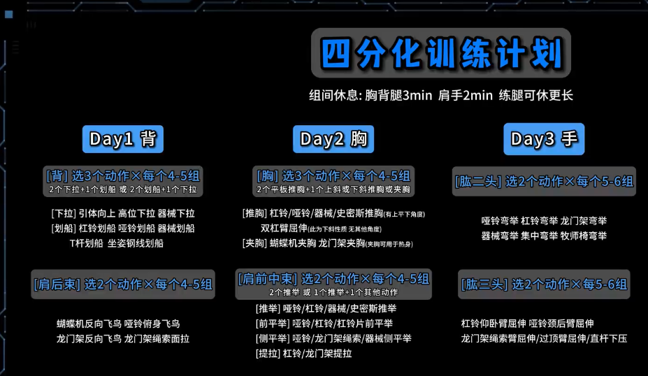

- [[Daily Log]]
	- 一天充值到账：8:00-23:00：共15h - 3h（吃饭洗澡） - 2h（余量）=10h
		- 上午：8:00-12:00 - 4h
			- DONE 算法-1h
		- 下午：13:00-18:00 - 5h
			- gre阅读-1h
			- DONE 八股-1h
			- Xplorer二手市场优化方案 - 1h
			- DONE 做出健身方案 - 30min
			- ((67ecdd55-7481-4f10-a3a8-02b9309b8d29)) -30min
		- 晚上：18:00-23:00 - 5h
			- GRE作文-1h
			- 八股-1h
	- log:
		- 9:00-10:00 洗漱上厕所
		- 10:00-11:00 优化mac的鼠标设置 - 计划外
		- 11:00-12:00 优化完之后顺手开始看视频 - 计划外
		- 12:00-13:00 吃饭
		- 13:00-13:56 看视频 - 计划外
		- 13:56-15:06 睡午觉
		- 15:06-18:21 写算法
		- 18:30-19:20 吃晚餐
		- 19:20-19:51 看视频 - 计划外
		- 19:51-20:22 跑步
		- 20:22-21:07 打电话+洗衣服
		- 21:07-21:36 洗澡
		- 21:36-22:56 做方案，打电话
- ---
- [[健身]]
	- # 练腹肌：
		- 原理：
			- 腹肌是被脂肪覆盖的，只有体脂率降低到一定程度（男性通常低于15%，女性低于20%）才能显现
			- 减脂：制造热量缺口
		- 方式：
			- B站的卷腹视频
	- # 计划
		- 参考视频：https://www.bilibili.com/video/BV1Hk4y187jF/?spm_id_from=333.337.search-card.all.click&vd_source=1e8424064855cc146aec87b7b7ee376d
		- 健身房和卷腹上一休一，周一课时间阴间，作为休息日。
			- 跑步放在休一
			- 
			- Day1: 周二
			- Day2: 周四
			- Day3: 周六
		- 锻炼时间：上午十一点
		- 奖惩机制：
			- 给WZJ打卡，在规定时间要在健身房
				- 先尝试一组，看看肌肉情况和其他实际状况再调整
			- 上一休一作为一组
				- 奖励：休息那天去对面奖励自己一份牛排（如果被wzj罚了1314，看看能不能让wzj请）
				- 惩罚：发puq：我是做不到自律的小朋友