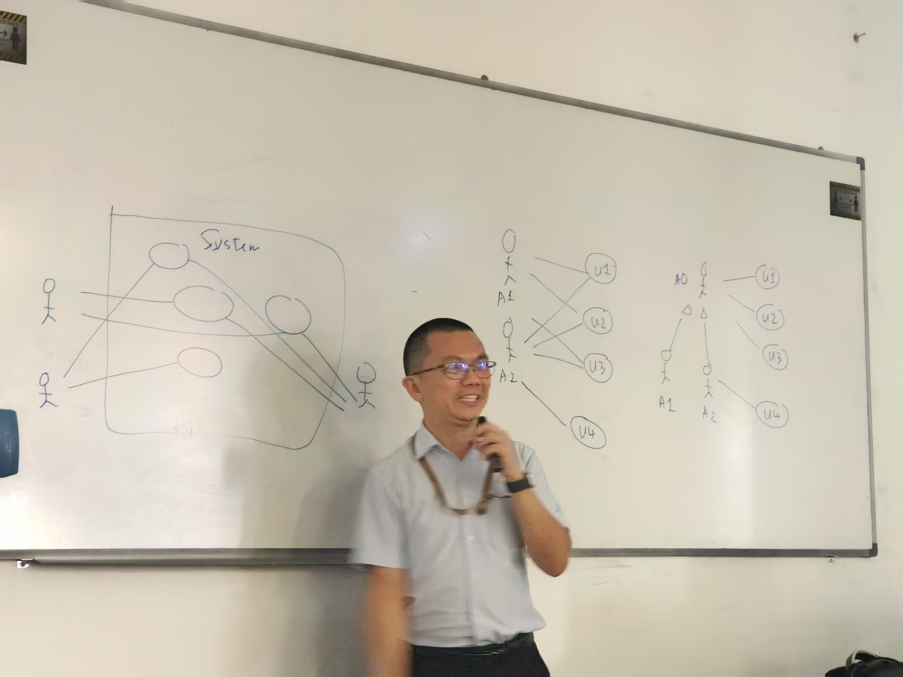
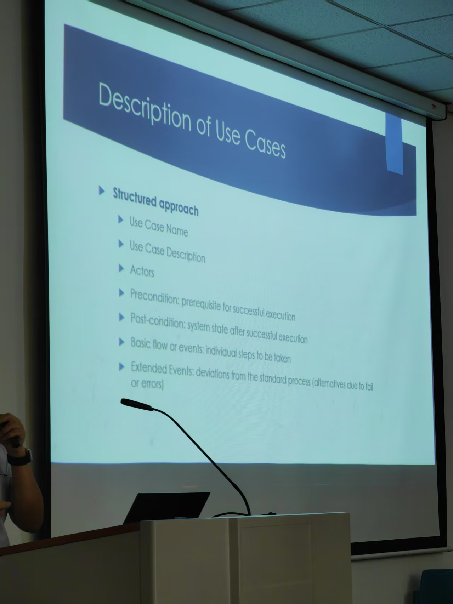

- [[Daily Log]]
	- 充值到账：8:00-10:00：14h
		- 今天计划：
			- 简历最后一点搞定
			- 广投
		- 上午：8:00-12:00：4h
			- DONE 健身
			- DONE 找exam unit
			- ((67fd9f86-9479-4272-8704-05012a46aa9e)) -1h
		- 下午：12:00-5:00：5h-2h上课：3h
			- ((67fd9ffe-de6a-4616-ac29-66ab9bf91188))
			  :LOGBOOK:
			  CLOCK: [2025-04-16 Wed 17:58:40]--[2025-04-16 Wed 17:58:41] =>  00:00:01
			  :END:
			- ((67fda010-45f3-485b-a948-28653d14e01a))
		- 晚上：5:00-10:00：5h-2h上课：3h
			- ((67fda01a-ee35-42fb-83d3-fc3351d935bf))
			- ((67fda022-0e84-4ebd-998c-9375afcf4ab8))
			- DONE 海投
			- DONE 把之前拆解出来的项目拉到mac上
	- log：
		- 8:00-8:30 起床洗漱上厕所
		- 8:30-9:14 计划外-看Agent tars的功能
		- 9:14-9:30 做计划
		- 9:30-10:30 健身
		- 10:30-11:00 吃午饭
		- 11:00-11:38 找exam unit
		- 12:00-13:00 看八股睡觉
		- 13:00-13:45 突发-帮周老师找人，看视频
		- 14:00-16:00 上课
		- 16:00-17:00 八股-并发的方案
		- 17:00-17:50 八股-并发的选择
		- 18:00-20:00 上课
- ---
- [[SADE]]
	- use case 在期中期末中占比最高，能到25%，非常重要
	- 他不喜欢左边的画法，喜欢右边的
		- 
	- 很多图的画法只会在exercise中给，后面就不会再给了，一定要听讲，跟着练
	- 考试画图必须严格按照PPT上他教的方式
	- 期末一共有7道图，需要画快点，不然画不完
	- 期中漏题：其中一共5道图，不能用铅笔，只能用钢笔，注意草稿和时间
		- 有道题是use case diagram，占比25%
		- 构建一个activity diagram 
-
-