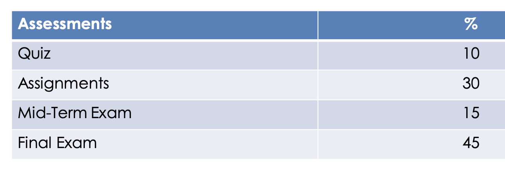

- [[SADE]]的分数构成：
	- 
		- ASS做软件架构图
		- Exam是给一个需求，要求画个架构图来满足要求
			- 不用写代码
		- ASS得早点做，12周之后就不回答问题了，越早越好
		- ASS会有QA，而且超级细，他说他自己很curious，会问你对内容的理解，会看每一个细节
		- Exercise最好每个都交，他会看，说你对他认真，他对你认真
	- 目前：
		- quiz：3.25+5=8.25 =》扣1.75
		- Mid：84.5 =》扣 15.5*15% =〉扣 2.32
		- 未知：15 -1.75-2.32 = 10
			- Assignment
			- Final