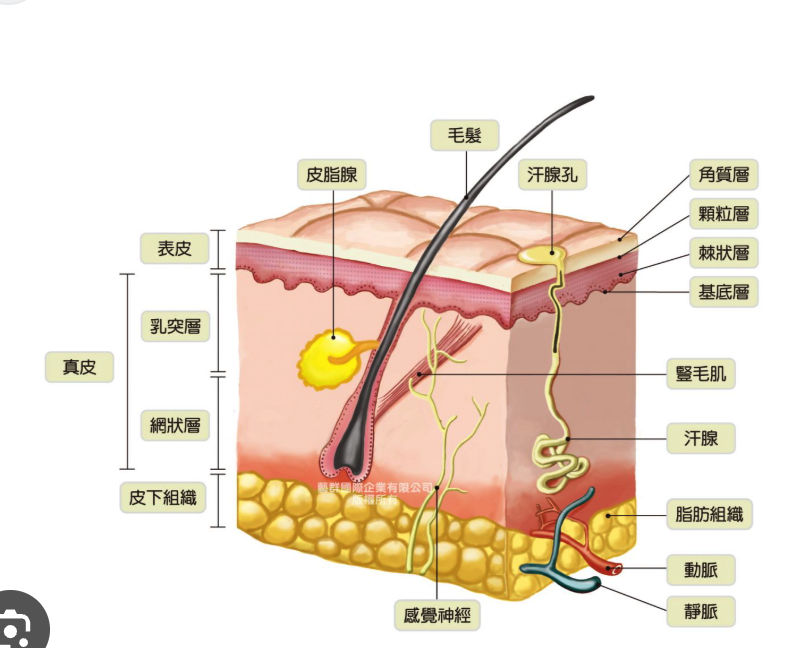

# 皮肤构成
	- 
	- 出油的原理
		- 雄激素导致皮脂腺分泌过多
		- 角质层受损导致基底层水份流失，皮脂腺额外出油来锁水
	- 皮肤色泽
		- 基底层的黑色素沉淀
	- 皮肤光泽
		- 真皮层的胶原蛋白和弹性蛋白决定你是否有皱纹，皮肤是否松弛
- # 护肤品作用
	- 控油：
		- 不刺激的洗面奶
			- 防止清洁力度过强，把角质层过度清洁导致受损，锁水能力下降，皮脂腺分泌
		- 精华
			- 水杨酸，果酸等，作用于毛囊口，溶解堵塞的油和死皮等，让油出来
			- 烟酰胺，视黄醇等，切断油脂合成信号，感觉这个最好别用
	- 保湿
		- 乳液/面霜
			- 神经酰胺，角鲨烷和泛醇 是主要有效成分，帮助稳固皮肤屏障，防止真皮层水份流失
			- 要想抹完不油 -》封闭剂如凡士林，矿物油的含量不能很高
	-