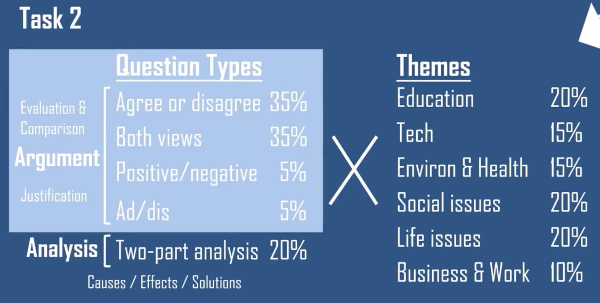
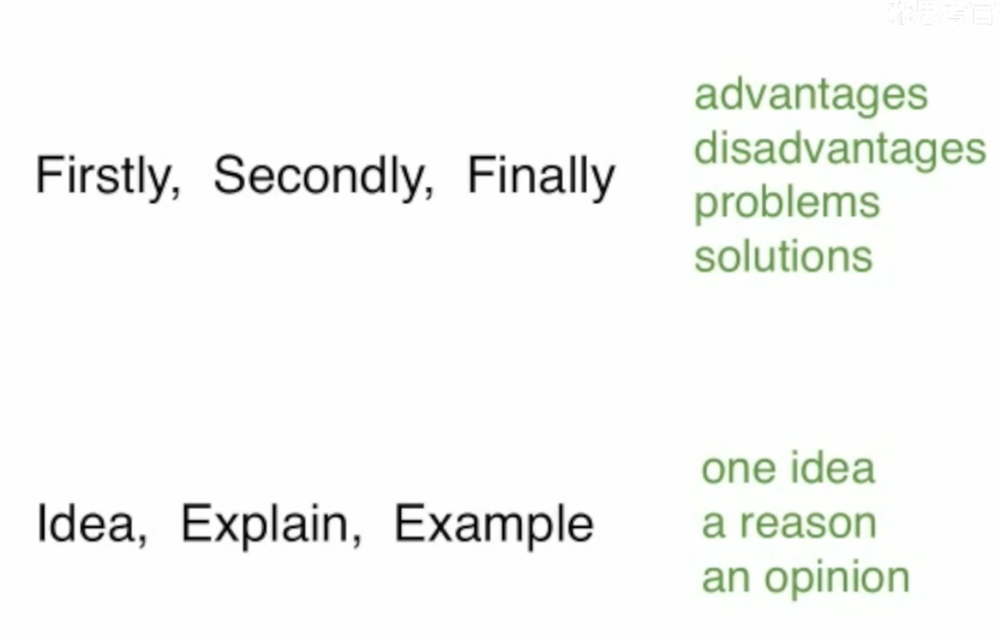

# 小作文
	- ## 流程图
		- #### 特点：
		  collapsed:: true
			- 分为三大类：
				- **生物生命周期**（如蚕的成长）
				- **工业制造流程**（如巧克力生产）
				- **自然/人工现象原理**（如水循环）
			- 150字，20min之内写完
		- #### 注意的点
		  collapsed:: true
			- 时态
			  logseq.order-list-type:: number
			- 选择主语，比如烧玻璃，那就尽量用玻璃作为主语，多用被动时态
			  logseq.order-list-type:: number
				- 注意主语物体在流程中的状态，比如第一步分类了材料，后面再提到材料就应该用 sorted material
				  logseq.order-list-type:: number
			- 清晰的关联词
			  logseq.order-list-type:: number
			- 明确流程的开头和结束，用明确的短语
			  logseq.order-list-type:: number
			- 为了保证语言的多样性，准备两套链接词，链接6个步骤
			  logseq.order-list-type:: number
				- 不能重复使用单词如step、process
				  logseq.order-list-type:: number
		- #### 技巧
			- 当步骤多于6步时，将多个步骤合并到一个阶段中，每个阶段2-三个步骤
			  logseq.order-list-type:: number
			- 小作文整体分为4段
			  logseq.order-list-type:: number
				- 第一段：用不同的话复述题目
				  logseq.order-list-type:: number
					- 要说明是什么图
					  logseq.order-list-type:: number
				- 第二段：陈述总步骤，再讲讲所有可以数出来的（这一段就是总结了，不需要再最后再写总结）
				  logseq.order-list-type:: number
					- 如工业制造里的原料数量
					  logseq.order-list-type:: number
					- **Overall**, the ethanol production involves 11 sequential steps, beginning with plant growth and culminating in the release of carbon dioxide, which is later reused by plants, thereby sustaining the cycle.
					  logseq.order-list-type:: number
				- 第三段：具体描写流程
				  logseq.order-list-type:: number
				- 第四段：具体描述流程
				  logseq.order-list-type:: number
		- #### 积累
			- 多个步骤合并到一个阶段的套话
			  logseq.order-list-type:: number
			- 多个阶段之间衔接的套话
			  logseq.order-list-type:: number
			- 固定的时态搭配
			  logseq.order-list-type:: number
		- #### 模版
			- ##### summary
				- N stages in the process of
				- X consists of N distinct stages
				- It could be witnessed in totally N steps in relation to the whole process.
			- ###### 连接词
				- The process begin with + step1
					- The process commences with
				- Subsequently + step2
					- At the outset,
				- Following this, + step3
					- Moving to the next phase,
				- After the stage, + step4
					- Prior to  step 5, + step4
				- Once step4 is completed, + step5
					- During the fifth phase,
				- Ultimately, + step6
					- The entire workflow culminates in
				- #### 循环
					- 最后再加上如何重新进入循环的：However, this carbon dioxide is reabsorbed by plants during photosynthesis, and the process starts again.
				- #### 分支处理
					- if + 分支1. Alternatively, + 分枝2
				- #### 分阶段
					- 工业制造、食品加工等线性流程
						- **In the preparatory stage**, [动作群] → **This phase focuses on** [目标]
						- **Upon completion of these initial steps**, the process transitions to **central phase**.
						- **Having undergone these complex procedures, the materials are ready for final processing.**  For the **The concluding stage**,
	- ## 折线图
		- ## 要点
			- 不能只用图片中给的单词，比如nuclear，得说是nuclear power 或者 nuclear station produce 多少电
			  logseq.order-list-type:: number
			- 折线图主要是比较各个点，而不是去描述某一条折线的具体趋势
			  logseq.order-list-type:: number
				- 每一次比较中，每条线至少写一个信息
				  logseq.order-list-type:: number
		- ## 结构
			- 结合图片信息和题干复述题目：
			  logseq.order-list-type:: number
			  collapsed:: true
				- 图片显示了xxx + 用了几个source + 在哪个时间段
				  logseq.order-list-type:: number
				- 素材：
				  logseq.order-list-type:: number
					- The line graph depicts the average monthly price fluctuations of three metals over a period of N years/ during the 2014.
					  logseq.order-list-type:: number
			- overall
			  logseq.order-list-type:: number
			  collapsed:: true
				- 描述整张图的主要特征，两句话，两个点。选择两条线来说就行了
				  logseq.order-list-type:: number
				- 要描述整个时期的趋势
				  logseq.order-list-type:: number
				- 素材：最高最低➕趋势
				  logseq.order-list-type:: number
				  collapsed:: true
					- 最高与最低：
					  logseq.order-list-type:: number
						- It is noticeable that the United Kingdom had by far the highest average carbon dioxide emissions throughout the period shown, while Portugal remained the lowest.
						  logseq.order-list-type:: number
					- 趋势：
					  logseq.order-list-type:: number
						- 上升：
						  logseq.order-list-type:: number
							- 平稳：In the meantime, while the amount of A climb gradually, the quantity of B declined steadily
							  logseq.order-list-type:: number
								- In the meantime, the amount of A climb gradually, whereas the quantity of B declined steadily
								  logseq.order-list-type:: number
								- In contrast to the gradually climb of the amount of A, the quantity of B experience a steadily declined.
								  logseq.order-list-type:: number
							- 激烈：
							  logseq.order-list-type:: number
								- In the mean time, while the amount of A soared dramatically, the quantity of B slumped substantially
								  logseq.order-list-type:: number
						- 稳定波动：
						  logseq.order-list-type:: number
							- In the mean time, while the amount of A oscillate widely, the quantity of B slumped substantially, the employment rate remained stable at 5% from 2010 to 2015.
							  logseq.order-list-type:: number
			- detail1
			  logseq.order-list-type:: number
			  collapsed:: true
				- 具体比较某个x值上的全部y值
				  logseq.order-list-type:: number
				- 常用位置：
				  logseq.order-list-type:: number
					- 起始位置+交点位置
					  logseq.order-list-type:: number
				- 素材：
				  logseq.order-list-type:: number
					- 句子1: 
					  logseq.order-list-type:: number
						- In [起始年], [对象A] accounted for [数值], making it the primary [主题],
						  logseq.order-list-type:: number
					- 句子2:
					  logseq.order-list-type:: number
						- 一个紧跟，两个很小：followed by [对象B] at [数值]. [对象C] and [对象D] contributed minimally, with just [数值] and [数值] respectively.
						  logseq.order-list-type:: number
						- 两个紧跟，一个很小：followed by B and C with [数值] and [数值] respectively. D is negligible. 
						  logseq.order-list-type:: number
					- 交点位置：
					  logseq.order-list-type:: number
						- Just X year later, B overtook A as primary of xxx
						  logseq.order-list-type:: number
			- detail2
			  logseq.order-list-type:: number
			  collapsed:: true
				- 比较一个时间段内的变化，讲出起点和终点的值
				  logseq.order-list-type:: number
				- 常用范围：
				  logseq.order-list-type:: number
					- 开始增长点到极点
					  logseq.order-list-type:: number
					- 开始下降点到稳定点
					  logseq.order-list-type:: number
					- 持续平稳
					  logseq.order-list-type:: number
				- 素材：
				  logseq.order-list-type:: number
					- Between timeA to timeB , A [rise/decline] dramatically to the peak of xxx from xxx. By contrast, B fell to only xxx in timeC. C remained relatively stable, at 时间范围, for the whole N years  period. D xxx by timeD.
					  logseq.order-list-type:: number
		- ## 表达
			- 在某时间某两个相交
			  logseq.order-list-type:: number
			- 某某在达到n后陷入长达多久的下降
			  logseq.order-list-type:: number
			- the number of 的多种表达
			  logseq.order-list-type:: number
				- the amount of 
				  logseq.order-list-type:: number
				- the quantity of
				  logseq.order-list-type:: number
				- a total of n XXX
				  logseq.order-list-type:: number
			- 数量第二高的
			  logseq.order-list-type:: number
				- the only behind + 第一
				  logseq.order-list-type:: number
				- the second adj
				  logseq.order-list-type:: number
	- ## 柱状图
	  collapsed:: true
		- 技巧：
			- 比较bars
				- 角度：
					- 时间变化
					- 物体变化
			- 1. 从左到右连续的时间变化：
				- 将柱连成线，按照折线图的写法来写
			- 2. 从左到右是不同的类：
				- 比较同一X变量的不同内容
				- 比较同一内容在不同X变量
			- 3. 分为多个图的时候，可以用第一个详情段描述一个图，另一个详情段描述另一个图
		- 结构：
			- 结合题目信息重述题干
			  logseq.order-list-type:: number
				- 数据用 compare
				  logseq.order-list-type:: number
			- 综述
			  logseq.order-list-type:: number
				- 不需要给出具体的数字，只需要用程度词描述即可
				  logseq.order-list-type:: number
				- 关注：
				  logseq.order-list-type:: number
					- 同一时间的最大\小值（比起同一个品类，能覆盖更多X值）
					  logseq.order-list-type:: number
					- 产品上升和下降的趋势
					  logseq.order-list-type:: number
			- 详细段1: 比较其中两个数据最类似或者差异最明显的X变量
			  logseq.order-list-type:: number
				- 选取开始节点时间的两者数据进行比较
				  logseq.order-list-type:: number
					- In time A. A 有多少数据, which almost double the number of XXX by B. Over the N years, A 的趋势是什么，具体变化了多少, whereas, B 的变化趋势和具体的数值. A 在某一年 overtook B 成为了XXX
					  logseq.order-list-type:: number
			- 详细段2: 比较剩余变量
			  logseq.order-list-type:: number
				- 同时比较剩下的几组变量，先比较同一时间的量
				  logseq.order-list-type:: number
					- 用 respectively 列举
					  logseq.order-list-type:: number
				- 比较交错时间点的数据
				  logseq.order-list-type:: number
				- 比较最后时间点的数据
				  logseq.order-list-type:: number
	- ## 饼状图
	  collapsed:: true
		- 类型：
			- 前后两个时间的饼图，比较数据的时间变化
			  logseq.order-list-type:: number
			- 两个不同主体的饼图，比较含量
			  logseq.order-list-type:: number
		- 技巧：
			- 主要比较比例，就算没有给也可以说
		- 段落：
			- 标题复写：
				- 展开合并的小数字：2个国家-》具体哪两个国家
				- 同义词替换
				- 主被动转化
			- 概述：
				- 2句子+2观点
				- 针对某一具体的类别，在不同的饼图或者不同的时间上出发，描述趋势或者最大最小占比。
				- 相同趋势的选两个
				- 不同趋势的选一个
			- 详细段1：描述两组趋势相反的相同趋势类别（与概述段段第一个句子的观点相同）
				- 具体描述趋势的首尾数据
			- 详细段2：描述第二句话的内容和图中其他没提到的内容
				-
- # 大作文
  collapsed:: true
	- 内容：
		- 针对这些内容准备话题 
			-
	- 得分要点：
		- 多加从句
		- 主题词汇
	- # 结构：
		- evaluation
		  logseq.order-list-type:: number
			- 结构同GRE作文，带让步的转折，先赞同对方观点，再提出己方观点并指出对方观点的一些不足，最后总结一下，可以再提出一点更高的方案
			  logseq.order-list-type:: number
		- 总体分为5段，开头结尾加两主体段落
		  logseq.order-list-type:: number
			- 开头一句，结尾两句，主体段落各自五句话，共13句，250个字以上，每一句最少20个字
			  logseq.order-list-type:: number
				- 10min整理提纲，开头5min，主体段各10min，5min 总结
				  logseq.order-list-type:: number
		- 列提纲：
		  logseq.order-list-type:: number
			- 找出题目topic和题干要求，防止跑题
			  logseq.order-list-type:: number
			- 选择两个主题段的内容
			  logseq.order-list-type:: number
				- 第一段赞同反方，第二段支持自己
				  logseq.order-list-type:: number
			- 头脑风暴找观点、原因、例子
			  logseq.order-list-type:: number
				- 分两个段落，分三层、观点、原因、例子，再用线条链接能说的
				  logseq.order-list-type:: number
		- ### 开头段
		  logseq.order-list-type:: number
			- 两句话
			  logseq.order-list-type:: number
				- 一句话介绍topic
				  logseq.order-list-type:: number
					- ### argument
						- people have different views about A as opposed to B
						- 注意如果指定了your opinion，就不能说people怎么怎么样
						  logseq.order-list-type:: number
							- It sometimes argued that 题干给的内容
							  logseq.order-list-type:: number
					- ### analysis
					  logseq.order-list-type:: number
						- 也是转述题干
						  logseq.order-list-type:: number
						- It is true that 题干描述的现象
						  logseq.order-list-type:: number
					- ### two-part 有两问的题
					  logseq.order-list-type:: number
						- 转述题干
						  logseq.order-list-type:: number
				- 一句话模糊响应文章问题
				  logseq.order-list-type:: number
					- ### argument
					  logseq.order-list-type:: number
						- 最好是带让步的转折
						  logseq.order-list-type:: number
						- While there are some benefits to doing 让步的内容, I believe that 自己认同的内容
						  logseq.order-list-type:: number
						- While I disagree with 极端的观点（极端词）, I do believe that 去掉极端词的观点
						  logseq.order-list-type:: number
					- ### analysis
					  logseq.order-list-type:: number
						- 给出原因/影响/解决方法
						  logseq.order-list-type:: number
						- There are various reasons why 现象, but governments could certainly take steps to address this issue
						  logseq.order-list-type:: number
					- ### two-part 有两问的题
					  logseq.order-list-type:: number
						- 给出对于两个问题的粗略看法
						  logseq.order-list-type:: number
						- while 问题一的看法, it would be 问题二的看法
						  logseq.order-list-type:: number
		- ### 主体段
		  logseq.order-list-type:: number
			- 主要的段落思路： {:height 281, :width 268}
			  logseq.order-list-type:: number
			- ### 多观点称述
			  logseq.order-list-type:: number
				- 虽然说连接词不重要，但是还是得记一些花哨一点的。主题词是最重要的
				  logseq.order-list-type:: number
					- 引入：Firstly
					  logseq.order-list-type:: number
						- The primary reason is that
						  logseq.order-list-type:: number
						- One major advantage of… is that。
						  logseq.order-list-type:: number
						- To commence with,
						  logseq.order-list-type:: number
					- 递进：Secondly
					  logseq.order-list-type:: number
						- Beyond this,
						  logseq.order-list-type:: number
						- To take this a step further,
						  logseq.order-list-type:: number
					- 再进：Finally
					  logseq.order-list-type:: number
						- Ultimately
						  logseq.order-list-type:: number
				- 观点称述手法：
				  logseq.order-list-type:: number
					- 举例
					  logseq.order-list-type:: number
						- For instance,
						  logseq.order-list-type:: number
						- This can be illustrated by 
						  logseq.order-list-type:: number
						- A clear example of this is
						  logseq.order-list-type:: number
					- 假设：if
					  logseq.order-list-type:: number
						- imagine/assuming/supposing
						  logseq.order-list-type:: number
					- 递进：
					  logseq.order-list-type:: number
						- I believe that 观点，and this could lead to 递进观点
						  logseq.order-list-type:: number
					- 让步
					  logseq.order-list-type:: number
						- Despite the fact that 
						  logseq.order-list-type:: number
						- While acknowledging that 
						  logseq.order-list-type:: number
						- There is no denying that. 
						  logseq.order-list-type:: number
			- ### 标准论述段
			  logseq.order-list-type:: number
				- 提出观点
				  logseq.order-list-type:: number
					- On the other hand,
					  logseq.order-list-type:: number
				- 解释原因：This is because
				  logseq.order-list-type:: number
					- **This is not only crucial for** ， but also
					  logseq.order-list-type:: number
		- ### 总结段
		  logseq.order-list-type:: number
			- 不要添加新信息，只要重复前面出现过的就行
			  logseq.order-list-type:: number
			- 改述一下开头的观点：In conclusion
			  logseq.order-list-type:: number
				- To sum up
				  logseq.order-list-type:: number
				- Taking everything into account,
				  logseq.order-list-type:: number